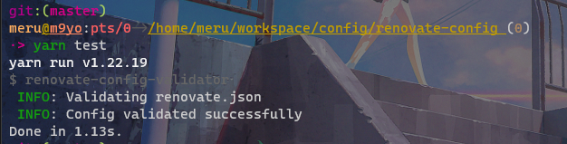

# renovate-config

[](https://github.com/m2en/renovate-config/actions/workflows/validate.yml)

## Usage

`renovate.json` を以下のように書きます。

```json
{
  "extends": [
    "github>m2en/renovate-config"
  ]
}
```

## Configuration Option

- タイム・ゾーンを東京 ( `:timezone(Asia/Tokyo)` ) に
- `dependencies` というラベルを自動付与
- 毎週土曜日に実行
- AutoMergeを有効にします。 (権限がある場合)
- `dependencyDashboard` が有効
- `devDependencies` (開発依存関係)と `dependencies` (依存関係) でパッケージの作成ルールが変わるように

## Renovate Config Validator

`renovate.json` に問題がないかを確認するには次のコマンドを実行します。

```sh
yarn test
```

以下のような実行結果が得られれば正しく設定できていることになります。



### Renovate Config Validator(GitHub Actions)

`master` ブランチ(メインブランチ)に対してのpush及び、pull requestが発行されると自動的に `yarn test` が実行されます。

このテストが正常に完了するまでメインブランチへのマージはできません。

----


- [Renovate Docs](https://docs.renovatebot.com/)
    - [Renovate Docs / Configuration Options](https://docs.renovatebot.com/configuration-options)   
    - [Renovate Docs / Shareable Config Presets](https://docs.renovatebot.com/config-presets/)